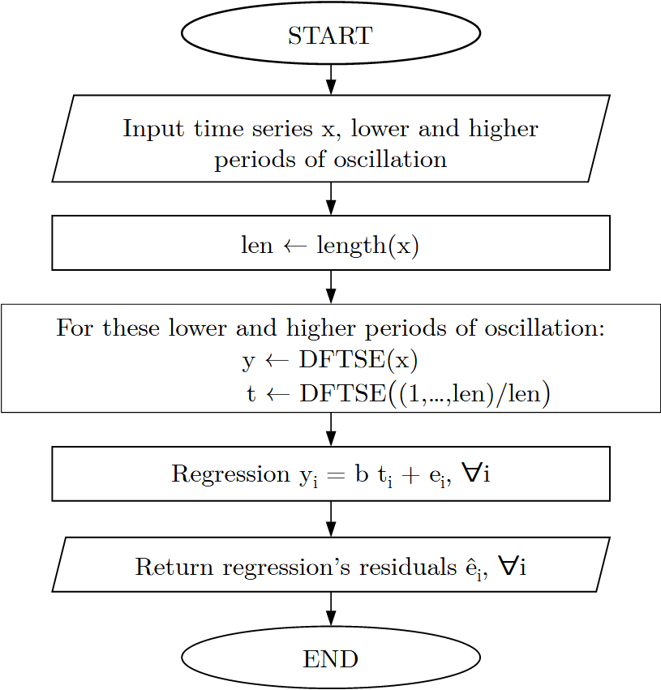

<!-- badges: start -->
  [](https://CRAN.R-project.org/package=corbouli)
  [](https://github.com/cadam00/corbouli/actions/workflows/R-CMD-check.yaml)
[](https://app.codecov.io/gh/cadam00/corbouli?branch=main)
<!-- badges: end -->

Implementation of the Corbae and Ouliaris ([2006](#ref-corbae2006)) Frequency
Domain Filter.

# **Install**

Development version of the package can be installed via
``` r
if (!require(remotes)) install.packages("remotes")
remotes::install_github("cadam00/corbouli")
```

# **Corbae-Ouliaris Frequency Domain Filtering**

Corbae and Ouliaris ([2006](#ref-corbae2006)) Frequency
Domain Filter is used for extracting cycles from either both on stationary
$I(0)$ and non-stationary $I(1)$ time series. This is one approximation of the
ideal band pass filter of the series.

As an example from Baxter and King ([1999](#ref-baxter1999)), the recommended
lower (1.5 years) and higher (8 years) frequency for filtering from various data
frequencies can be expressed from the following Table [1](#ref-table1).


<table style="width: 368px; height: 119px; vertical-align: middle;
text-align: center; margin-left: auto; margin-right: auto;" border="1"
align="center">
<tbody>
<tr style="height: 26.75px;">
<td style="width: 136.65px; height: 26px;" align="center">&nbsp;<b>Sample Frequency</b></td>
<td style="width: 136.65px; height: 26px;" align="center"><b>Lower</b></td>
<td style="width: 136.65px; height: 26px;" align="center"><b>Higher</b></td>
</tr>
<tr style="height: 26px;" align="center">
<td style="width: 136.65px; height: 26px;" align="center">&nbsp;<b>Month</b></td>
<td style="width: 136.65px; height: 26px;" align="center">18</td>
<td style="width: 136.65px; height: 26px;" align="center">96</td>
</tr>
<tr style="height: 26px;" align="center">
<td style="width: 136.65px; height: 26px;" align="center">&nbsp;<b>Quarter</b></td>
<td style="width: 136.65px; height: 26px;" align="center">6</td>
<td style="width: 136.65px; height: 26px;" align="center">32</td>
</tr>
<tr style="height: 26px;" align="center">
<td style="width: 136.65px; height: 26px;" align="center">&nbsp;<b>Year</b></td>
<td style="width: 136.65px; height: 26px;" align="center">1.5</td>
<td style="width: 136.65px; height: 26px;" align="center">8</td>
</tr>
</tbody>
</table>
<p align="center">
  <span class="nocase" id="ref-table1"> Table 1: Low and high frequency in periods.
  </span>
</p>


The same table in fragments of $\pi$ can be transformed into the Table
[2](#ref-table2) using the $lower\ frequency = 2 / higher\ period$ and
$higher\ frequency = 2 / lower\ period$. For instance, for quarterly sampled
time series, we have $lower\ frequency = 2 / 32 = 0.0625$ and
$higher\ frequency = 2 / 6 = 0.3333$.

<table style="width: 368px; height: 119px; vertical-align: middle;
text-align: center; margin-left: auto; margin-right: auto;" border="1"
align="center">
<tbody>
<tr style="height: 26.75px;">
<td style="width: 136.65px; height: 26.75px;" align="center">&nbsp;<b>Sample Frequency</b></td>
<td style="width: 136.65px; height: 26.75px;">&nbsp;Lower</td>
<td style="width: 136.65px; height: 26.75px;">Higher</td>
</tr>
<tr style="height: 26px;" align="center">
<td style="width: 136.65px; height: 26px;" align="center">&nbsp;<b>Month</b></td>
<td style="width: 136.65px; height: 26px;" align="center">0.0208</td>
<td style="width: 136.65px; height: 26px;" align="center">0.1111</td>
</tr>
<tr style="height: 26px;" align="center">
<td style="width: 136.65px; height: 26px;" align="center">&nbsp;<b>Quarter</b></td>
<td style="width: 136.65px; height: 26px;" align="center">0.0625</td>
<td style="width: 136.65px; height: 26px;" align="center">0.3333 </td>
</tr>
<tr style="height: 26px;" align="center">
<td style="width: 136.65px; height: 26px;" align="center">&nbsp;<b>Year</b></td>
<td style="width: 136.65px; height: 26px;" align="center">0.25</td>
<td style="width: 136.65px; height: 26px;" align="center">1</td>
</tr>
</tbody>
</table>
<p align="center">
  <span class="nocase" id="ref-table2"> Table 2: Low and high frequency in fragments of $\pi$.
</p>

The longer the series, the more the long run frequency can be expressed by using
lower frequency equal to 0. Moreover, the output gap can be expressed using
high-frequency equal to 1 ([Ouliaris, 2009](#ref-ouliaris2009)).

# **Example**

For this example, the quarterly US GDP in billions of chained 2017 dollars
(Seasonally adjusted) will be used. For 

``` r
# Import package to workspace
library(corbouli)

# Import "USgdp" dataset
data(USgdp)

plot(USgdp, main = "Quarterly US GDP in billions of chained 2017 dollars
(Seasonally adjusted)", ylab = "", yaxt="n")
```

<p align="center">
    
</p>
<p class="caption" align="center">
<span id="ref-Figure1"></span>Fig. 1: USgdp dataset.
</p>

```r
# Extract cycles
co <- corbae_ouliaris(USgdp, low_freq = 0.0625, high_freq = 0.3333)

# Plot cycles of filtered series
plot(co, main = "Corbae-Ouliaris FD Filter cycles",
     ylab = "Billions of chained 2017 dollars (Seasonally adjusted)")
```

<p align="center">
    
</p>
<p class="caption" align="center">
<span id="ref-Figure1"></span>Fig. 2: Corbae-Ouliaris FD Filter cycles.
</p>

As noted by Ouliaris [2009](#ref-ouliaris2009), for setting `high_freq = 1` the
output gap series than business cycle one will have higher volatility (Figure
).

```r
# Extract output gap
og <- corbae_ouliaris(USgdp, low_freq = 0.0625, high_freq = 1)

# Plot Business cycle vs Output gap
plot(co, main = "Business cycle vs Output gap",
     ylab = "Billions of chained 2017 dollars (Seasonally adjusted)",
     col = adjustcolor("blue", alpha.f = 0.7), lwd = 2)
lines(og, col = adjustcolor("orange", alpha.f = 0.7), lwd = 2)
legend(x = "bottomleft", lwd = 2, text.font = 2,
       col= adjustcolor(c("blue","orange"), alpha.f = 0.7),
       legend=c("Business cycle", "Output gap"))
```

<p align="center">
    
</p>
<p class="caption" align="center">
<span id="ref-Figure1"></span>Fig. 3: Business cycle vs Output gap.
</p>

# **References**

Baxter, M., & King, R. (1999). <span class="nocase" id="ref-baxter1999">
Measuring Business Cycles: Approximate Band-Pass Filters for Economic Time
Series,</span> <em>Review of Economics and Statistics</em> <b>81</b>(4), pp.
575-593

Corbae, D., Ouliaris, S., and Phillips, P. (2002).
<span class="nocase" id="ref-corbae2002"> Band Spectral Regression with
Trending-Data, <em>Econometrica</em> <b>70</b>(3), pp. 1067-1109.

Corbae, D. and Ouliaris, S. (2006)<span class="nocase" id="ref-corbae2006">
Extracting Cycles from Nonstationary Data,</span>in Corbae D., Durlauf S.N.,
and Hansen B.E. (eds.) <em>Econometric Theory and Practice: Frontiers of
Analysis and Applied Research</em>. Cambridge: Cambridge University Press, pp.
167–177. https://doi.org/10.1017/CBO9781139164863.008.

Ouliaris, S. (2009) <span class="nocase" id="ref-ouliaris2009">Ideal Band Pass
Filter For Stationary/Non-Stationary Series.</span>
http://forums.eviews.com/viewtopic.php?f=15&t=1513.

Pérez Pérez, J. (2011) <span class="nocase" id="ref-perez2011">COULIARI: Stata
module to implement Corbae-Ouliaris frequency domain filter to time series
data.</span> <em>Statistical Software Components</em>, S457218, Boston College
Department of Economics.
